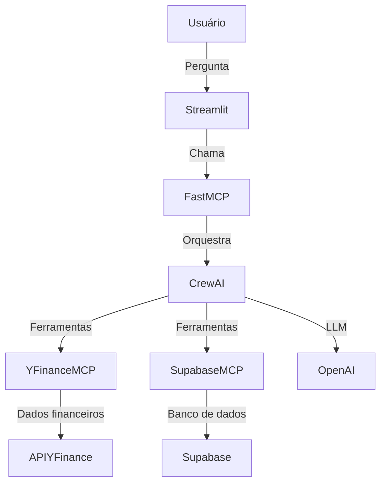

# 🤖 Multi-Agent Analyst – Chat Inteligente Multi-Fonte

Bem-vindo ao **Multi-Agent Analyst**, uma plataforma de chat inteligente que integra múltiplas fontes de dados (financeiros, banco de dados, IA) em uma interface moderna e fácil de usar!

---

## 🚀 O que é este projeto?

O Multi-Agent Analyst é uma solução baseada em agentes de IA (CrewAI) que permite ao usuário:
- Fazer perguntas sobre finanças, bancos de dados e dados gerais
- Obter respostas automáticas, estruturadas e contextualizadas
- Visualizar resultados em formato de texto, tabela ou JSON
- Integrar múltiplas fontes (YFinance, Supabase, OpenAI)

---

## 🛠️ Principais Recursos

- **Chat Web Moderno** (Streamlit)
- **Agentes Multi-Fonte** (CrewAI + FastMCP)
- **Respostas Estruturadas** (tabela, texto, JSON)
- **Memória por usuário** (contexto de conversa)
- **Fallback inteligente** se fontes externas estiverem offline
- **Logs detalhados** do servidor MCP

---

## 🏗️ Arquitetura



---

## ⚡ Instalação Rápida

1. **Clone o repositório:**
   ```bash
   git clone <url-do-repo>
   cd <pasta-do-projeto>
   ```
2. **Instale as dependências Python:**
   ```bash
   pip install -r requirements.txt
   ```
3. **Configure o arquivo `.env`:**
   ```env
   OPENAI_API_KEY=sua_chave_openai_aqui
   SUPABASE_ACCESS_TOKEN=seu_token_supabase_aqui # (opcional)
   ```
4. **Rode o sistema:**
   ```bash
   python main.py
   ```
   Escolha entre terminal ou interface web (Streamlit).

---

## 💬 Exemplos de Uso

- "Qual o preço atual da ação AAPL?"
- "Quais tabelas existem no banco?"
- "Mostre os dados financeiros mais recentes da Microsoft"

---

## 🖥️ Interface Web

- Acesse em: [http://localhost:8501](http://localhost:8501)
- Faça perguntas e veja respostas estruturadas!

---

## 🧩 Tecnologias Utilizadas

- **Python 3.8+**
- **Streamlit** (interface web)
- **CrewAI** (agentes de IA)
- **FastMCP** (orquestração de ferramentas)
- **YFinance MCP** (dados financeiros)
- **Supabase MCP** (banco de dados)
- **OpenAI** (LLM)

---

## 🛟 Suporte e Dúvidas

- Consulte o arquivo `SETUP_GUIDE.md` para detalhes de instalação
- Se tiver problemas de encoding no terminal, execute `chcp 65001` antes de rodar
- Para dúvidas, abra uma issue ou entre em contato!

---

## 📄 Licença

MIT
