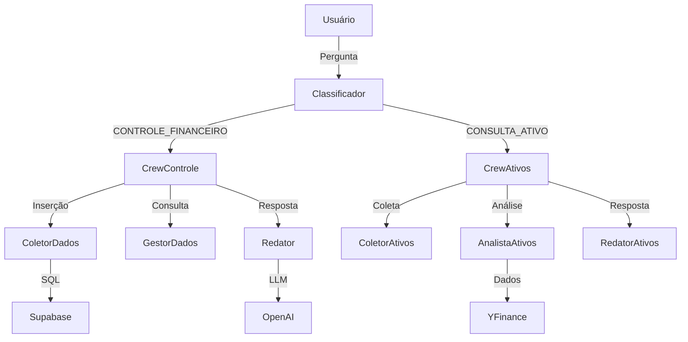

# 🤖 Financebot

Bem-vindo ao **Financebot**, uma plataforma baseada em agentes de IA (CrewAI) que oferece controle financeiro pessoal e consultas de ativos através de uma interface moderna e intuitiva!

---

## 🚀 O que é este projeto?

O Financebot é uma solução multi-agente que permite ao usuário:
- **Controle Financeiro**: Registrar receitas, despesas e consultar saldos
- **Consultas de Ativos**: Ver cotações, preços e análises de mercado
- **Classificação Automática**: O sistema identifica automaticamente o tipo de solicitação
- **Memória Contextual**: Mantém histórico de conversas por usuário
- **Interface Web Moderna**: Chat intuitivo com Streamlit

---

## 🛠️ Principais Recursos

- **Multi-Agentes Inteligentes** (CrewAI)
- **Classificação Automática** de solicitações
- **Controle Financeiro Completo** (receitas/despesas)
- **Consultas de Ativos** em tempo real
- **Interface Web Moderna** (Streamlit)
- **Memória por Usuário** (contexto persistente)
- **Logs Detalhados** das crews e agentes

---

## 🏗️ Arquitetura Multi-Agentes



### 🤖 Agentes Especializados

#### **Crew: Controle Financeiro**
- **Coletor de Dados**: Extrai informações de transações
- **Gestor de Dados**: Executa operações no Supabase
- **Redator**: Formata respostas amigáveis

#### **Crew: Consulta de Ativos**
- **Coletor de Ativos**: Identifica símbolos e tipos de consulta
- **Analista de Ativos**: Busca dados via YFinance
- **Redator de Ativos**: Formata informações de mercado

---

## ⚡ Instalação Rápida

1. **Clone o repositório:**
   ```bash
   git clone <url-do-repo>
   cd <diretório>
   ```

2. **Instale as dependências:**
   ```bash
   uv sync
   ```

3. **Configure o arquivo `.env`:**
   ```env
   OPENAI_API_KEY=sua_chave_openai_aqui
   SUPABASE_ACCESS_TOKEN=seu_token_supabase_aqui # (opcional)
   ```

4. **Execute o sistema:**
   ```bash
   python main.py
   ```

---

## 💬 Exemplos de Uso

### 💰 Controle Financeiro
- "Gastei 50 reais no mercado hoje"
- "Recebi 1000 de salário ontem"
- "Quanto gastei no mês de julho?"
- "Mostre meu saldo atual"

### 📈 Consultas de Ativos
- "Qual o preço atual da PETR4?"
- "Como está o dólar?"
- "Cotação do Bitcoin"
- "Análise da ação AAPL"

---

## 🖥️ Interface Web

- **Acesse**: [http://localhost:8501](http://localhost:8501)
- **Chat Intuitivo**: Faça perguntas em linguagem natural
- **Respostas Estruturadas**: Visualize dados de forma clara
- **Histórico**: Mantenha contexto das conversas

---

## 🧩 Tecnologias Utilizadas

- **Python 3.8+**
- **CrewAI** (multi-agentes inteligentes)
- **Streamlit** (interface web)
- **FastMCP** (comunicação MCP)
- **YFinance MCP** (dados financeiros)
- **Supabase MCP** (banco de dados)
- **OpenAI GPT-4** (LLM)
- **uv** (gerenciador de pacotes)

---

## 🚀 Como Executar

### Opção 1: Via main.py (Recomendado)
```bash
python main.py
# Escolha a opção desejada no menu
```

### Opção 2: Comandos Diretos
```bash
# Servidor MCP
uv run src/mcp_server.py

# Interface Web (em outro terminal)
streamlit run src/app.py
```

---

## 🛟 Suporte e Dúvidas

- Consulte o arquivo `SETUP_GUIDE.md` para detalhes completos de instalação
- Para dúvidas, abra uma issue ou entre em contato!

---

## 📄 Licença

MIT
